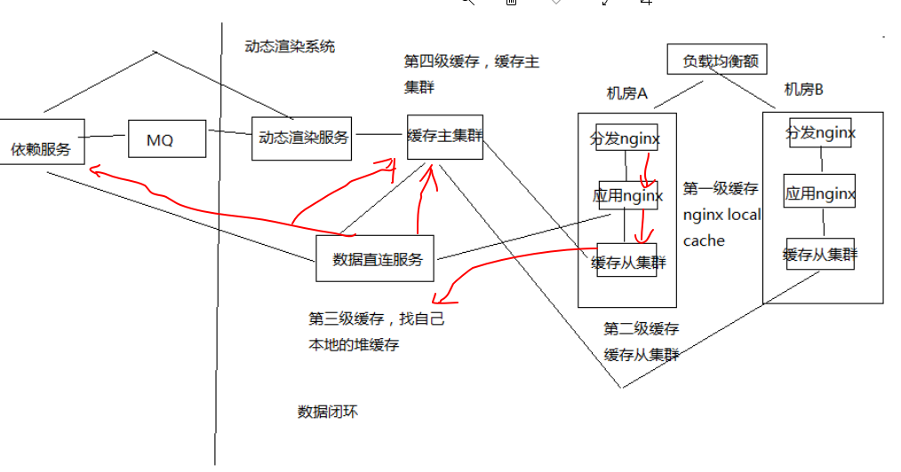

# 127. 商品详情页动态渲染系统：架构整体设计

[[toc]]

## 动态渲染系统架构设计

1. 依赖服务（源） -> MQ -> 动态渲染服务 -> 多级缓存
2. 负载均衡 -> 分发层nginx -> 应用层nginx -> 多级缓存
3. 多级缓存 -> 数据直连服务

如上图：分为了三块：

1. 负载均衡 + 多机房模板渲染 + 1、2 级缓存

    当自己缓存失效时，请求数据直连服务
2. 数据直连服务 + 三级缓存

    找自己本地缓存，不存在时从主集群获取信息，
    如果主集群也没有，则直接从源服务获取信息，并重建主集群缓存，
    返回应用层 nginx
3. 动态渲染服务 + 主集群

    通过 mq 接收源服务的各种事件，把更改变更到主集群中去，
    而主集群与从集群通过什么手段进行同步过去。

## 动态渲染系统思想

### 数据闭环

数据闭环架构

1. 依赖服务：商品基本信息，规格参数，商家/店铺，热力图，商品介绍，商品维度，品牌，分类，其他
2. 依赖服务发送数据变更消息到 MQ
3. 数据异构 Worker 集群，监听 MQ，将原子数据存储到 redis，发送消息到 MQ
4. 数据聚合 Worker 集群，监听 MQ，将原子数据按维度聚合后存储到 redis，三个维度（商品基本信息、商品介绍、其他信息）

数据闭环，就是数据的自我管理，所有数据原样同步后，根据自己的逻辑进行后续的数据加工，走系统流程，以及展示

数据形成闭环之后，依赖服务的抖动或者维护，不会影响到整个商品详情页系统的运行

数据闭环的流程：

1. 数据异构（多种异构数据源拉取）
2. 数据原子化
3. 数据聚合（按照维度将原子数据进行聚合）
3. 数据存储（Redis）

### 数据维度化

数据维度分为以下几大类：

- 商品基本信息：标题、扩展属性、特殊属性、图片、颜色尺码、规格参数
- 商品介绍
- 非商品维度其他信息：分类、商家、店铺、品牌
- 商品维度其他信息：采用 ajax 异步加载，如：价格、促销、配送至、广告、推荐、最佳组合，等等

存储策略：

- ssdb: 这种基于磁盘的大容量/高性能的 kv 存储，保存商品维度、主商品维度、商品维度其他信息，数据量大，不能光靠内存去支撑
- redis：纯内存的 kv 存储，保存少量的数据，比如非商品维度的其他数据：商家数据、分类数据、品牌数据

一个完整的数据，拆分成多个维度，每个维度独立存储，就避免了一个维度的数据变更就要全量更新所有数据的问题

不同维度的数据，因为数据量的不一样，可以采取不同的存储策略

### 系统拆分

系统拆分更加细：依赖服务、MQ、数据异构 Worker、数据同步 Worker、Redis、Nginx+Lua，
每个部分的工作专注，影响少，适合团队多人协作

- 异构 Worker 的原子数据，基于原子数据提供的服务更加灵活
- 聚合 Worker 将数据聚合后，减少 redis 读取次数，提升性能

前端展示分离为商品详情页前端展示系统和商品介绍前端展示系统，不同特点，分离部署，不同逻辑，互相不影响

### 异步化

- 异步化，提升并发能力，流量削峰
- 消息异步化，让各个系统解耦合

    如果使用依赖服务调用商品详情页系统接口同步推送，那么就是耦合的

- 缓存数据更新异步化

    数据异构 Worker 同步调用依赖服务接口，但是异步更新 redis

### 动态化

- 数据获取动态化

    nginx+lua 获取商品详情页数据的时候，按照维度获取，比如商品基本数据、其他数据（分类、商家）
- 模板渲染实时化

    支持模板页面随时变化，因为采用的是每次从 nginx+redis+ehcache 缓存获取数据，渲染到模板的方式，
    因此模板变更不用重新静态化 HTML
- 重启应用秒级化：nginx+lua 架构，重启在秒级
- 需求上线快速化：使用 nginx+lua 架构开发商品详情页的业务逻辑，非常快速

### 多机房多活

- Worker 无状态

    同时部署在各自的机房时采取不同机房的配置，来读取各自机房内部部署的数据集群（redis、mysql等）

    将数据异构 Worker 和数据聚合Worker设计为无状态化，可以任意水平扩展，

    Worker 无状态化，但是配置文件有状态，不同的机房有一套自己的配置文件，只读取自己机房的 redis、ssdb、mysql 等数据
- 每个机房配置全链路接入 nginx

    商品详情页 nginx + 商品基本信息 redis 集群 + 其他信息 redis 集群、商品介绍 nginx + 商品介绍 redis 集群

    部署统一的 CDN 以及 LVS+KeepAlived 负载均衡设备

## 小结

本章还是很吃力的，光看上层架构，是看懂了，但是一想具体的业务场景，就懵逼了。期待后续的课程
