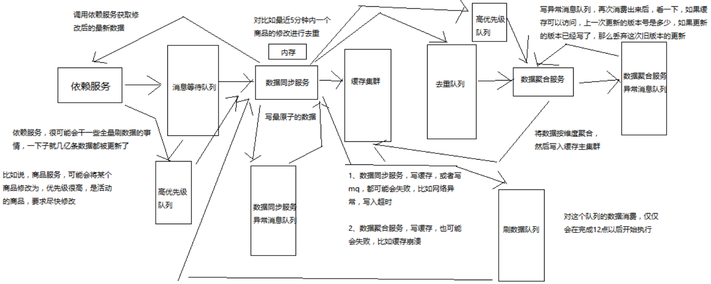

# 129. 商品详情页动态渲染系统：复杂的消息队列架构设计

[[toc]]
消息队列很多时候并不是简单的使用一个 MQ 就可以的，为了应对复杂的场景，需要设计一套复杂的队列

## 几种队列解释

本列有以下几种队列：

- 任务等待队列
- 任务排重队列（异构 Worker 对一个时间段内的变更消息做排重）
- 失败任务队列（失败重试机制）
- 优先级队列，刷数据队列（依赖服务洗数据）、高优先级队列（活动商品优先级高）

这些队列服务于某一种业务场景而存在的，如下图，已经很复杂了

- 依赖服务

  - 数据变更信息投递到 **消息等待队列** 中
  - 针对活动商品需要快速响应，投递到 **高优先级队列** 中
- 数据同步服务
  - 消费 **消息等待队列** 中的事件，把原子数据写入到缓存集群中
  - 消费 **高优先级队列**
  - 同时可以对短时间内多次修改的商品去重，然后投递到 **去重队列**

    这里猜想应该是设置一个阀值，比如 5 分钟往去重队列投递一次
  - 需要写缓存，可能因为网络问题导致写入失败，投递到 **数据同步服务异常消息队列**  
  - 自己又要消费 **数据同步服务异常消息队列** 中的数据（相当于重试）

      还要保证脏数据的处理，比如一个商品修改三次，中间那一次写失败，
      那么在处理中间这次重试的时候，还要保证这条脏数据不被写入缓存中
- 数据聚合服务

  - 消费 **去重队列** 进行数据的聚合，然后写入 缓存集群 中
  - 消费 **自己的高优先级队列**
  - 消费 **数据聚合服务异常消息队列**

- 刷数据队列

  用来解决全量数据更新，这个队列只在晚上 12 点之后开始消费。

## 多队列架构总结

看图很复杂，简单一点：

1. **数据同步服务** 通过 **消息等待队列** 与源服务交互
2. **数据聚合服务** 通过 **去重队列** 与数据同步服务进行交互

三个服务之间的交互，每个服务之间的交互都有以下队列：

1. 正常交互队列
2. 重试队列
3. 高优先级队列

另外的队列就是全量刷数据。

总结结束；大概意思本人明白了，其中一些细节点还不知道，期待后续
