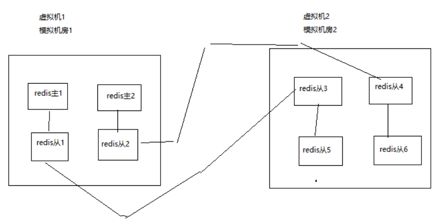

# 139. 商品详情页动态渲染系统：部署双机房一主三从架构的 redis 主集群

[[toc]]

## 部署架构



使用一个 redis 客户端，多份配置文件的方式启动 8 台 redis 实例

```
  192.168.99.11 （机房1）              192.168.99.12  （机房2）

master：6401   master：6402          slave: 6401    slave: 6402   
slave: 6403    slave：6404           slave: 6403    slave：6404
```

主从示意如下，一个 master 有一个从，从下面又挂一个从，组成了一个树形结构

```
192.168.99.11 master：6401
192.168.99.11 slave: 6403 ↑
192.168.99.12 slave: 6401 ↑
192.168.99.12 slave: 6403 ↑

192.168.99.11 master：6402
192.168.99.11 slave: 6404 ↑
192.168.99.12 slave: 6402 ↑
192.168.99.12 slave: 6404 ↑
```

看最上面的示意图。当机房 1 挂掉之后，由于机房 2 的 6401 是机房 1 的 6403 的从，
所以机房 2 的 6401 会升级为 master，这样一来，在机房 2 上还是存在一主一从的高可用 redis

## 开始搭建

首先要把之前部署的 redis-test 给 kill 掉。在 /usr/local/redis 中安装一个 reds

```bash
[root@eshop-detail01 local]# ps -ef | grep redis
root     12126 21476  0 06:29 pts/4    00:00:00 grep redis
root     31096 21476  0 02:43 pts/4    00:00:20 /usr/local/redis-test/redis-2.8.19/src/redis-server *:6379                                       
[root@eshop-detail01 local]# kill -9 31096
```

```bash
cd /usr/local/redis
tar -zxvf redis-2.8.19.tar.gz
cd redis-2.8.19
make

# 复制 4 份配置文件，并修改配置文件中的 prot 值为文件名对应的端口号
cd /usr/local/redis/redis-2.8.19
cp redis.conf redis-6401.conf
cp redis.conf redis-6402.conf
cp redis.conf redis-6403.conf
cp redis.conf redis-6404.conf

# 以此启动 redis
cd /usr/local/redis/redis-2.8.19
nohup src/redis-server  redis-6401.conf &
nohup src/redis-server  redis-6402.conf &
nohup src/redis-server  redis-6403.conf &
nohup src/redis-server  redis-6404.conf &

# 查看 redis 进程
[root@eshop-detail01 redis-2.8.19]# ps -ef | grep redis
root     14987 21476  0 06:38 pts/4    00:00:00 src/redis-server *:6401         
root     14992 21476  0 06:39 pts/4    00:00:00 src/redis-server *:6402         
root     14999 21476  0 06:40 pts/4    00:00:00 src/redis-server *:6403         
root     15002 21476  0 06:40 pts/4    00:00:00 src/redis-server *:6404         
root     15006 21476  0 06:40 pts/4    00:00:00 grep redis
```

配置树形主从，下面是其中一台从节点的配置方式，按照上面讲解的树形结构配置自己的主节点

```bash
cd /usr/local/redis/redis-2.8.19
[root@eshop-detail01 redis-2.8.19]# src/redis-cli -p 6403
127.0.0.1:6403> slaveof 192.168.99.11 6401
OK
127.0.0.1:6403> info replication
# Replication
role:slave
master_host:192.168.99.11
master_port:6401
master_link_status:up
master_last_io_seconds_ago:1
master_sync_in_progress:0
slave_repl_offset:29
slave_priority:100
slave_read_only:1
connected_slaves:0
master_repl_offset:0
repl_backlog_active:0
repl_backlog_size:1048576
repl_backlog_first_byte_offset:0
repl_backlog_histlen:0
```

另外一台也如法炮制启动 4 个 redis 实例，另外一台机器上的 6401 信息

```bash
[root@eshop-detail02 redis-2.8.19]# src/redis-cli -p 6401
127.0.0.1:6401> info replication
# Replication
role:slave
master_host:192.168.99.11  # 机房 1 的 6403 是 master
master_port:6403
master_link_status:up
master_last_io_seconds_ago:1
master_sync_in_progress:0
slave_repl_offset:85
slave_priority:100
slave_read_only:1
connected_slaves:1  # 自己下面又有一个从 节点 6403
slave0:ip=192.168.99.12,port=6403,state=online,offset=15,lag=0
master_repl_offset:15
repl_backlog_active:1
repl_backlog_size:1048576
repl_backlog_first_byte_offset:2
repl_backlog_histlen:14
```

## 验证主从是否生效

```bash
# 在 192.168.99.11 上操作
cd /usr/local/redis/redis-2.8.19
src/redis-cli -p 6401
set k1 v1 # 去第二台机器上查看是否能获取到值
set k1 v2  # 修改 k1 为 v2 ，再去验证

# 在 192.168.99.12 上操作
cd /usr/local/redis/redis-2.8.19
src/redis-cli -p 6401
get k1    # 观察是否能获取到值

```
