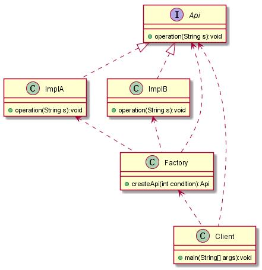
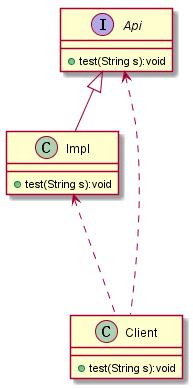
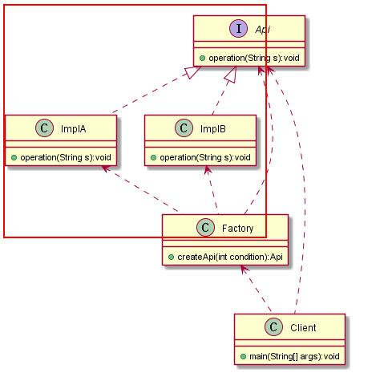
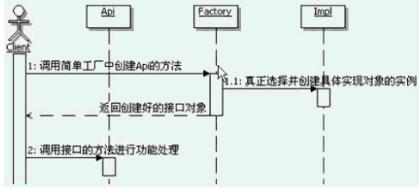

# 简单工厂

## 初识简单工厂

### 定义

提供一个创建对象实例的功能，而无需关心其具体实现。被构建实例的类型可以是接口、抽象类，也可以是具体的类

### 结构和说明



**APi：** 定义客户所需要的功能接口

**Impl：** 具体实现Api的实现类，可能会有多个

**Factory：** 工厂，选择合适的实现类来创建Api的接口对象

**Client：** 客户端，通过Factory去获取Api接口对象，然后面向Api接口编程

```java
public interface Api {
    void operation(String s);
}
public class ImplA implements Api {
    @Override
    public void operation(String s) {
        System.out.println("实现a:" + s);
    }
}
public class ImplB implements Api {
    @Override
    public void operation(String s) {
        System.out.println("实现b:" + s);
    }
}
public class Factory {
    public static Api createApi(int condition){
        if(condition == 1){
            return new ImplA();
        }else if(condition == 2) {
            return new ImplB();
        }
        return null;
    }
}
public class Client {
    public static void main(String[] args) {
        Api api = Factory.createApi(1);
        api.operation("hello");
        api = Factory.createApi(2);
        api.operation("hello");
    }
}

```

### 接口回顾

1. Java 中接口的概念：在 Java 中接口是一种特殊的抽象类

2. 接口用来干什么:

 通常用接口来定义实现类的外观，就相当于一份契约，根据外部应用需要的功能，约定了实现类应该要实现的功能

3. 接口的思想： 封装隔离

4. 使用接口的好处

 只要接口不变，内部实现的变化就不会影响到外部应用，从而使得系统更灵活，具有更好的扩展性和可维护性

5. 接口和抽象类的选择

 （1）：优先选用接口

 （2）：在如下情况选抽象类：既要定义子类的行为，又要为子类提供公共的功能

### 面向接口编程回顾

面向接口编程是 Java 编程中的一个重要原则。在 Java 程序设计里面，非常讲究层的划分和模块的划分。

比如常见的三层结构
在一个层内部的各个模块交互也要通过接口
不管是一层还是一个模块或则一个组件，都是一个被接口隔离的整体

------------

## 体会简单工厂

### 不用模式的解决方案



```java
public interface Api {
    void test(String s);
}
public class Impl implements Api {
    @Override
    public void test(String s) {
        System.out.println("不用模式的解决方案:" + s);
    }
}
public class Client {
    public static void main(String[] args) {
        Api api = new Impl();
        api.test("hello");
    }
}
```

### 用模式的解决方案

参考上面的 **结构和说明** 中的代码

------------

## 理解简单工厂

### 一个典型的疑问

**首先来解决一个常见的疑问：** 可能有朋友会认为，上面的示列中的简单工厂看起来不就是把客户端里面的 `new Impl()` 移动到简单工厂里面吗？不还是一样通过 new  实现类来得到接口吗？  把 `new Impl()` 这句话放到客户端和放到简单工厂里面有什么不同吗？

`理解这个问题的重点就在于理解简单工厂所处的位置。`



红框代表一个封装体，完全在红框中的为封装体内部的，工厂和接口暴露了一部分给外部。

### 认识简单工厂

1. 简单工厂的功能

 可以用来创建接口、抽象类或则是普通类的实例

2. 静态工厂

 通常把简单工厂类实现成一个工具类，直接使用静态方法就可以了，也就是说简单工厂的方法通常都是静态的，所以也被称为静态工厂

3. 万能工厂

 一个简单工厂理论上可以用来构造任何对象，所以又称之为“万能工厂”

4. 简单工厂创建对象的范围

 建议控制在一个独立的组件级别或则一个模块级别

5. 简单工厂的调用顺序示意图

  

6. 简单工厂命名的建议

 1. 类名建议为：“模块名称 + Factory ”
 2. 方法名通常为：“ get + 接口名称”或则是“ create + 接口名称”
 3. 不建议把方法名称命名为 new + 接口名称

### 简单工厂中方法的写法

简单工方法的内部主要实现的功能是“选择合适的实现类”来创建实例对象

选择 --> 如何选? ---> 选择的参数 --> 参数从何而来？

1. 参数来源于client
2. 参数来源于配置文件
3. 参数来源于系统自身，比如运行期间的某个值

`注：`如果是从客户端在调用工厂的时候，传入选择的参数，这就说明客户端必须知道每个参数的含义，也需要理解每个参数对应的功能处理。这就要求必须在一定程度上，向客户暴露一定的内部实现细节。

### 可配置的简单工厂

使用反射加上配置文件，来实现添加新的实现类过后，无需修改代码，就能把这个新的实现类加入应用中。

可配置的简单工厂，也是通过选择，但是这个选择不是体现在方法中了。 而是通过配置文件

这里配置是配置一些参数，用于选择哪一个实现。

### 简单工厂的优缺点

**优点：**

1. 帮助封装： 真正实现面向接口编程
2. 解耦：客户端和具体实现可以解耦

**缺点：**

1. 可能增加客户端的复杂度：需要调用接口，就得了解这些参数的含义
2. 不方便扩展子工程

------------

## 思考简单工厂

### 简单工厂的本质

简单工厂的本质是： 选择实现 **重点是选择**

### 何时选用简单工厂

1. 如果想要完全封装隔离具体实现，让外部只能通过接口来操作封装体，那么可以选用简单工厂，让客户端通过工厂来获取相应的接口，而无需关心具体实现。

2. 如果想要把对外创建对象的职责集中管理和控制，可以选用简单工厂，一个简单工厂可以创建很多的、不相关的对象，可以把对外创建对象的职责集中到一个简单工厂来，从而实现集中管理和控制
