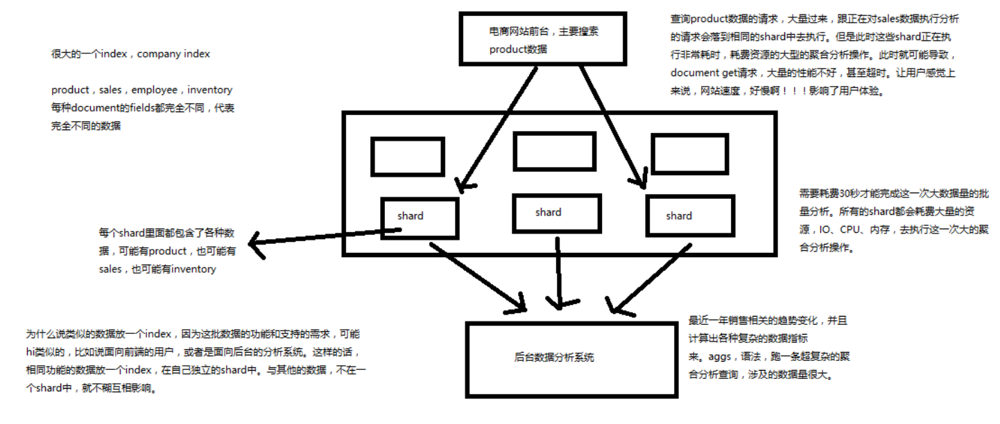

# 初步解析 document 的核心元数据

初步解析 document 的核心元数据以及图解剖析 index 创建反例

[[toc]]

1. `_index 元数据`
2. `_type元数据`
3. `_id元数据`

插入一条数据查看返回来的元数据信息

```json
PUT /test_index/test_type/1
{
  "test_content": "test test"
}

------------ 响应

{
  "_index": "test_index",
  "_type": "test_type",
  "_id": "1",
  "_version": 1,
  "result": "created",
  "_shards": {
    "total": 2,
    "successful": 2,
    "failed": 0
  },
  "created": true
}
```

## `_index 元数据`

简单说：可以看成是 mysql 中的一个库

1. 代表一个 document 存放在哪个 index 中
2. 类似的数据放在一个索引，非类似的数据放不同索引

    product index（包含了所有的商品），

    sales index（包含了所有的商品销售数据），

    inventory index（包含了所有库存相关的数据）。

    如果你把 product，sales，human resource（employee），全都放在一个大的 index 里面，比如说 company index，不合适的。
3. index 中包含了很多类似的 document

    类似是什么意思?

    其实指的就是说，这些 document 的 fields 很大一部分是相同的，你说你放了 3个 document，每个 document 的 fields 都完全不一样，这就不是类似了，就不太适合放到一个index里面去了。
    大致上的意思就是：在查询不相关数据的时候，相同 index 下所占用的资源是共享的，不相关的资源访问的时候就会影响它的访问（当然是在数据量很大的情况下容易感受到这种性能情况）  
4. 索引名称必须是小写的，不能用下划线开头，不能包含逗号；如：product，website，blog 都可以

下面图解不类似的情况下出现的性能问题



## `_type元数据`

简单说：可以看成是 mysql 一个库中的表

1. 代表 document 属于 index 中的哪个类别（type）
2. 一个索引通常会划分为多个 type，逻辑上对 index 中有些许不同的几类数据进行分类

    因为一批相同的数据，可能有很多相同的 fields，但是还是可能会有一些轻微的不同，可能会有少数 fields 是不一样的，举个例子，就比如说，商品，可能划分为电子商品，生鲜商品，日化商品，等等。
3. type 名称可以是大写或者小写，但是同时不能用下划线开头，不能包含逗号

## `_id元数据`

1. 代表 document 的唯一标识，与 index 和 type 一起，可以唯一标识和定位一个 document
2. 我们可以手动指定 document 的 id（put /index/type/id），也可以不指定，由 es 自动为我们创建一个 id
