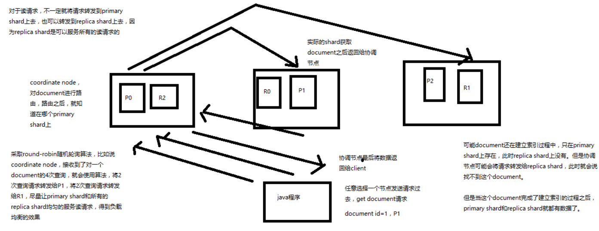

# document 查询内部原理图解揭秘

1. 客户端发送请求到任意一个 node，成为 coordinate node
2. coordinate node 对 document 进行路由，将请求转发到对应的 node

    此时会使用 round-robin 随机轮询算法，在 primary shard 以及其所有 replica 中随机选择一个，让读请求负载均衡
3. 接收请求的 node 返回 document 给 coordinate node
4. coordinate node 返回 document 给客户端

**特殊情况：**

document 如果还在建立索引过程中，可能只有 primary shard 有，任何一个 replica shard 都没有，
此时可能会导致无法读取到 document，但是 document 完成索引建立之后，primary shard 和 replica shard 就都有了

::: warning 疑问
对于这种情况没有处理么？在 mysql 的一些读写分离应用中，就会出现这种情况，

master 写入后，slave 还没有来得及同步，这个时候流量被转发到 slave 的时候无法获取到数据

一般的做法是：强制走 master；那么对于 es 来说这种场景怎么办？
:::

