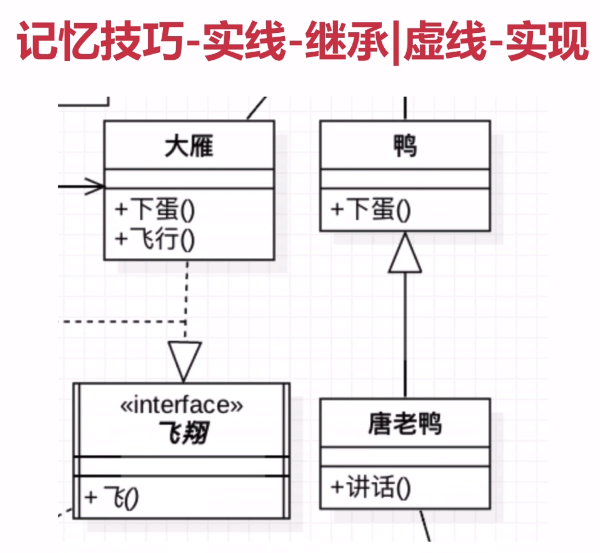
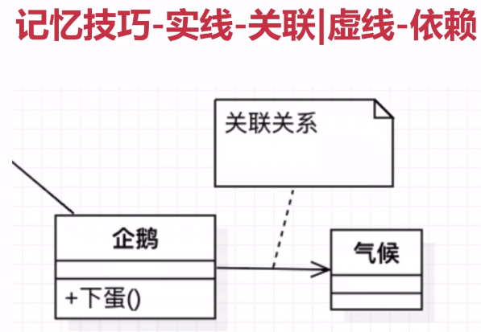
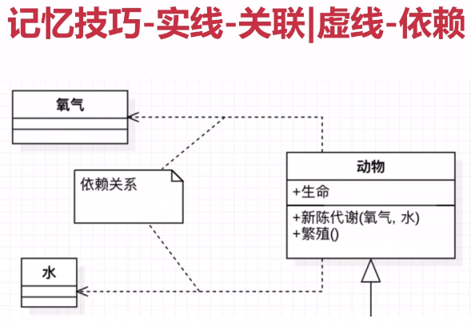
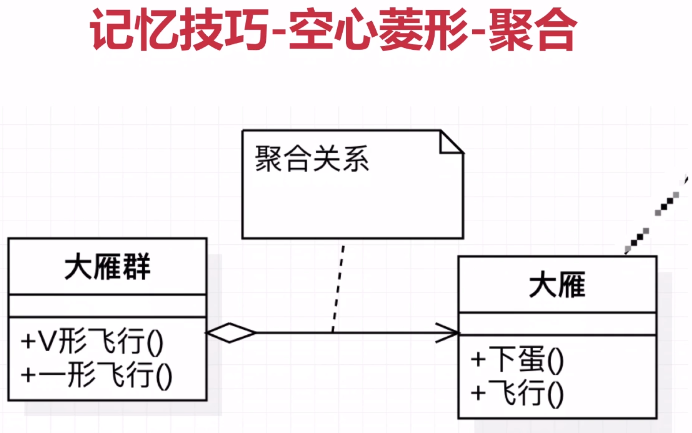
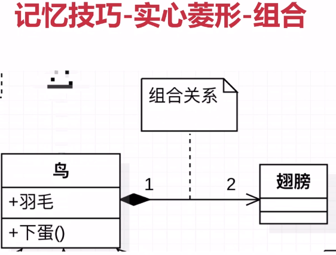
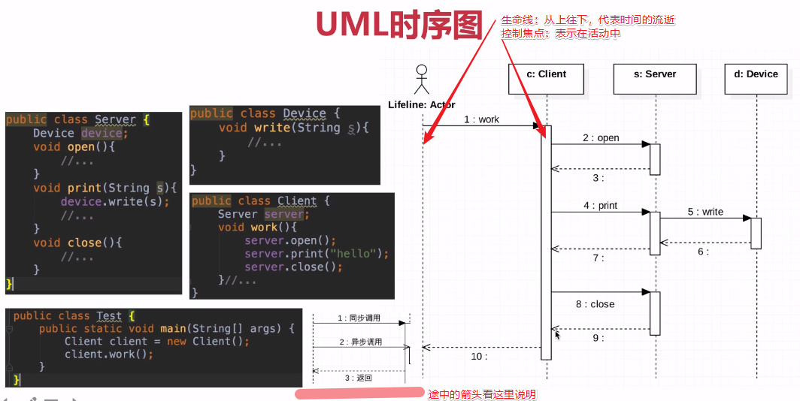

# 本章导航

## UML类图及时序图入门

* 定义
* 特点
* 分类
* 类图
* 时序图
* 记忆技巧

## UML定义

* 统一建模语言（Unified Modeling Language，缩写 UML）
* 非专利的第三代建模和规约语言

## UML特点

* UML是一种开放的方法
* 用于说明，可视化，构建和编写一个正在开发的面向对象的，软件密集系统的制品的开放方法
* UML展现了一系列最佳工程实践

  这些最佳实践在对大规模，复杂系统进行建模方面，特别是在软件架构层次已经被验证有效

## UML2.2分类

UML2.2中一共定义了14种图示，分类如下

* 结构式图形：强调的是系统式的建模
  * 静态图（类图，对象图，包图） : 本课程主要讲解类图和时序图
  * 实现图（组件图，部署图）
  * 剖面图
  * 符合结构图
* 行为式图形：强调系统模型中触发的事件
  * 活动图
  * 状态图
  * 用例图
* 交互式图形：属于**行为式**图形子集合，强调系统模型中资料流程
  * 通信图
  * 交互概述图（UML2.0）
  * 时序图（UML2.0）
  * 时间图（UML2.0）

## UML类图

* Class Diagram ：用于表示类、接口、实例等之间相互的静态关系
* 虽然命中叫类图，但类图中并不只有类

## 记忆技巧

### UML箭头方向： **从子类指向父类**

提示：可能会认为子类是以父类为基础的，箭头应从父类指向子类

* 定义子类时需要通过**extends**关键字指定父类
* 子类一定是知道父类定义的，但父类并不知道子类的定义
* 只有知道对方信息时才能指向对方
* 所以箭头的方向是 **从子类指向父类**

### 实线-继承  |  虚线-实现

* 空心三角箭头：继承或实现
* 实现-继承：is a关系，扩展目的，不虚，很结实
* 虚线-实现：虚线代表”虚”，无实体

### 实线-关联 | 虚线-依赖

* 虚线-依赖关系：临时用一下，若即若离，虚无缥缈，若有若无
  * 表示一种使用关系，一个类需要借助另一个类来实现功能
  * 一般是一个类使用另一个类作为参数使用，或作为返回值
* 实现-关联关系：关系稳定，实打实的关系，铁哥们
  * 表示一个类对象和另一个类对象有关联
  * 通常是一个类中有另一个类对象作为属性

### 空心菱形-聚合 | 实心菱形-组合

菱形就是一个盛东西的器皿（例如盘子）

* 聚合 ： 代表空器皿里可以放很多相同的东西，聚在一起（箭头方向所指的类）
* 组合 ： 代表满器皿里已经有实体结构的存在，生死与共

* 空心菱形-聚合
  * 整体和局部的关系，两者有着独立的生命周期，是 has a 的关系
  * 弱关系
  * 消极的词语：弱-空

* 实心菱形-组合
  * 整体与局部的的关系，和聚合的关系相比，关系更加强烈，两者有相同的生命周期，constains-a的关系
  * 强关系
  * 积极的词：强-满

常见数字表达及含义，假设有A类和B类，数字标记在A类侧

* 0..1 : 0或1个实例 ： 在某一个时刻，B 可以和 0或1个 A 实例相关
* 0..* : 0或多个实例
* 1..1 : 1个实例    :（和 1 是也一样的）
* 1    ：只能有一个实例
* 1..* : 至少有一个实例

## UML时序图

Sequence Diagram ：是显示对象之间交互的图，这些对象是按时间顺序排列的

时序图中包括的建模元素主要有：

* 对象（Actor）
* 生命线（Lifeline）
* 控制焦点（Focus of control）
* 消息（Message）等

三个对象实例之间的调用关系；强调生命线，代表时间的流逝，从上往下，注意调用之间的箭头的高低，表示了时间的流逝
