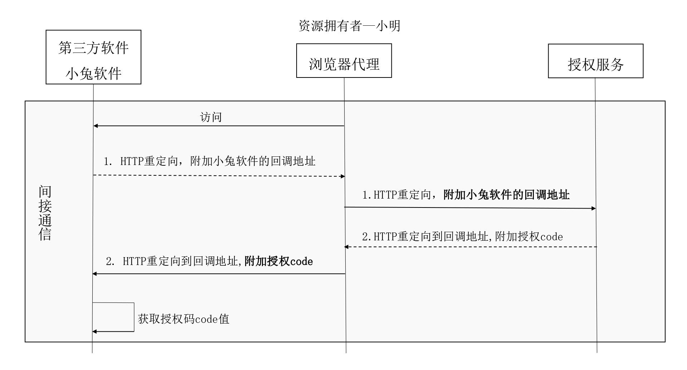
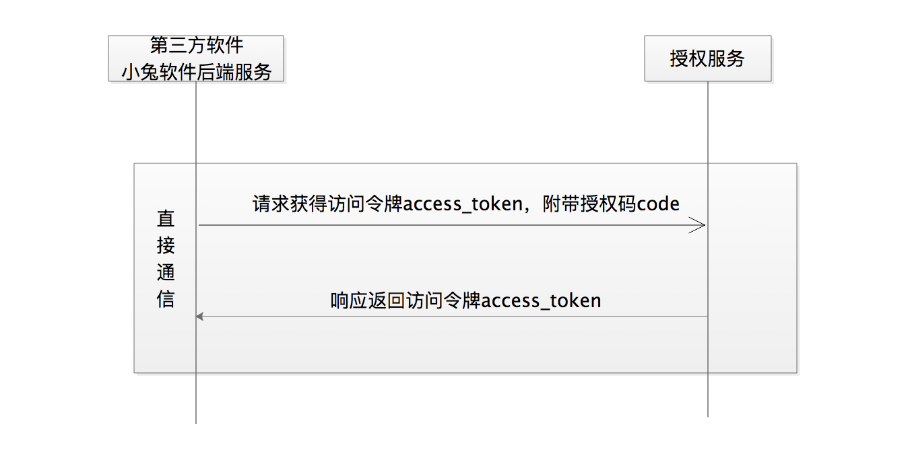

---
tags:
  - oath 角色类型

outline: deep
---


# 授权码许可类型中，为什么一定要有授权码？

在上一讲，我提到了 OAuth 2.0 的授权码许可类型，在小兔打单软件的例子里面，小兔最终是通过 **访问令牌** 请求到小明的店铺里的订单数据。同时呢，我还提到了，这个 **访问令牌是通过授权码换来的**。到这里估计你会问了，为什么要用授权码来换令牌？为什么不能直接颁发访问令牌呢？

## 为什么需要授权码？

在讲这个问题之前，我先要和你同步下，在 OAuth 2.0 的体系里面有 4 种角色，按照官方的称呼它们分别是：

- 资源拥有者
- 客户端
- 授权服务
- 受保护资源。

不过，这里的客户端，我更愿意称其为第三方软件，而且在咱们这个课程中，都是以第三方软件在举例子。所以，在后续的讲解中我统一把它称为第三方软件。

所以，你在看官方资料的时候，可以自己对应下。为了便于你理解，我还是拿小兔软件来举例子，将官方的称呼 照进现实，对应关系就是，

- **资源拥有者 -> 小明**
- **第三方软件 -> 小兔软件**
- **授权服务 -> 京东商家开放平台的授权服务**
- **受保护资源 -> 小明店铺在京东上面的订单**

在理解了这些概念以后，让我们继续。

你知道，**OAuth 诞生之初就是为了解决 Web 浏览器场景下的授权问题**，所以我基于浏览器的场景，在上一讲的小明使用小兔软件打印订单的整体流程的基础上，画了一个授权码许可类型的序列图。

当然了，这里还是有小兔软件来继续陪伴着我们，不过这次为了能够更好地表述授权码许可流程，我会把小兔软件的前端和后端分开展示，并把京东商家开放平台的系统按照 OAuth 2.0 的组件拆分成了 **授权服务** 和 **受保护资源服务**。如下图所示：


突然看到这个序列图增加了这么多步骤的时候，你是不是有些紧张？那如果我告诉你再细分的话步骤还要更多，你是不是就更困惑了？

不过，别紧张，这没啥关系。一方面，咱们这一讲的 **重点** 就是 **跟授权码相关的流程**，你只需关注这里的重点步骤，也就是 **两次重定向相关的步骤** 就够了。在下一讲中，我再教你如何将这些步骤进一步拆解。另一方面，我接下来还会用另一种视角来帮助你分析这个流程。

我们继续来看这张序列图。从图中看到，在第 4 步授权服务生成了授权码 code，按照一开始我们提出来的问题，如果不要授权码，这一步实际上就可以直接返回访问令牌 access_token 了。

按着这个没有授权码的思路继续想，如果这里直接返回访问令牌，那我们肯定不能使用重定向的方式。因为 **这样会把安全保密性要求极高的访问令牌暴露在浏览器上** ，从而将会面临访问令牌失窃的安全风险。显然，这是不能被允许的。

也就是说，如果没有授权码的话，我们就只能把访问令牌发送给第三方软件小兔的后端服务。按照这样的逻辑，上面的流程图就会变成下面这样：


到这里，看起来天衣无缝。小明访问小兔软件，小兔软件说要打单你得给我授权，不然京东不干，然后小兔软件就引导小明跳转到了京东的授权服务。到授权服务之后，京东商家开放平台验证了小兔的合法性以及小明的登录状态后，生成了授权页面。紧接着，小明赶紧点击同意授权，这时候，京东商家开放平台知道可以把小明的订单数据给小兔软件。

于是，京东商家开放平台没含糊，赶紧生成访问令牌 access_token，并且通过后端服务的方式返回给了小兔软件。这时候，小兔软件就能正常工作了。

这样，问题就来了，什么问题呢？ **当小明被浏览器重定向到授权服务上之后，小明跟小兔软件之间的 「连接」 就断了**，相当于此时此刻小明跟授权服务建立了「连接」后，将一直「停留在授权服务的页面上」。**你会看到图 2 中问号处的时序上，小明再也没有重新「连接」到小兔软件。**

但是，这个时候小兔软件已经拿到了小明授权之后的访问令牌，也使用访问令牌获取到了小明店铺里的订单数据。这时，考虑到「小明的感受」，小兔软件应该要通知到小明，但是如何做呢？现在「连接断了」，这事儿恐怕就没那么容易了。

OK，为了让小兔软件能很容易地通知到小明，**还必须让小明跟小兔软件重新建立起 「连接」**。这就是我们看到的第二次重定向，小明授权之后，又重新重定向回到了小兔软件的地址上，这样 **小明就跟小兔软件有了新的 「连接」**。

到这里，你就能理解在授权码许可的流程中，为什么需要两次重定向了吧。

**为了重新建立起这样的一次连接，我们又不能让访问令牌暴露出去**，就有了这样一个 **临时的、间接的凭证：授权码**。因为小兔软件最终要拿到的是安全保密性要求极高的访问令牌，并不是授权码，而授权码是可以暴露在浏览器上面的。这样有了授权码的参与，访问令牌可以在后端服务之间传输，**同时呢还可以重新建立小明与小兔软件之间的「连接」**。这样通过一个授权码，既「照顾」到了小明的体验，又「照顾」了通信的安全。

这下，你就知道为什么要有授权码了吧。

那么，在执行授权码流程的时候，**授权码和访问令牌在小兔软件和授权服务之间到底是怎么流转的呢？**要回答这个问题，就需要继续分析一下授权码许可类型的通信过程了。

## 授权码许可类型的通信过程

图 1 的通信过程中标识出来的步骤就有 9 个，一步步地去分析看似会很复杂，所以我会用另一个维度来分析以帮助你理解，也就是从 **直接通信** 和 **间接通信** 的维度来分析。

- 间接通信就是指：获取授权码的交互，
- 直接通信就是指：通过授权码换取访问令牌的交互。

接下来，我们就一起分析下吧，看看哪些是间接通信，哪些又是直接通信。

### 间接通信

我们先分析下为什么是「间接」。

我们把图 1 中获取授权码 code 的流程 「放大」，并换个角度来看一看，也就是 **将浏览器这个代理放到第三方软件小兔和授权服务中间**。于是，我们来到了下面这张图：



这个过程，仿佛有这样的一段对话。

- 小明：「你好，小兔软件，我要访问你了。」

- 小兔软件：「好的，我把你引到授权服务那里，我需要授权服务给我一个授权码。」

- 授权服务：「小兔软件，**我把授权码发给浏览器了**。」

- 小兔软件：「好的，我从浏览器拿到了授权码。」

不知道你注意到没有，第三方软件小兔和授权服务之间，并没有发生直接的通信，而是 **通过浏览器这个「中间人」来 「搭线」的** 。因此，我们说这是一个间接通信的方式。

### 直接通信

那我们再分析下，授权码换取访问令牌的交互，为什么是「直接」的。我们再把图 1 中获取访问令牌的流程「放大」，就得到了下面的图示：



相比获取授权码过程的间接通信，获取访问令牌的直接通信就比较容易理解了，就是第三方软件小兔获取到授权码 code 值后，向授权服务发起获取访问令牌 access_token 的通信请求。**这个请求是第三方软件服务器跟授权服务的服务器之间的通信**，都是在后端服务器之间的请求和响应，因此也叫作 **后端通信**。

### 两个 「一伙」

了解了上面的通信方式之后，不知道你有没有意识到，OAuth 2.0 中的 4 个角色是 **「两两站队**」 的：

- **资源拥有者**  和 **第三方软件** 站在一起，因为第三方软件要代表资源拥有者去访问受保护资源；
- **授权服务** 和 **受保护资源** 站在一起，因为授权服务负责颁发访问令牌，受保护资源负责接收并验证访问令牌。


讲到这里的时候，你会发现在这一讲，介绍授权码流程的时候我都是以浏览器参与的场景来讲的，那么浏览器一定要参与到这个流程中吗？

**其实，授权码许可流程，不一定要有浏览器的参与**。接下来，我们就继续分析下其中的逻辑。

## 一定要有浏览器吗？

OAuth 2.0 发展之初，开放生态环境相对单薄，以浏览器为代理的 Web 应用居多，授权码许可类型 「理所当然」 地被应用到了通过浏览器才能访问的 Web 应用中。

但实际上，OAuth 2.0 是一个授权理念，或者说是一种授权思维。它的授权码模式的思维可以移植到很多场景中，比如微信小程序。在开发微信小程序应用时，我们 **通过授权码模式获取用户登录信息**，官方文档的地址示例中给出的  `grant_type=authorization_code`  ，就没有用到浏览器。

根据微信官方文档描述，开发者获取用户登录态信息的过程正是一个授权码的许可流程：

- 首先，开发者通过 `wx.login(Object object)`  方法获取到登录凭证 code 值，这一步的流程是在小程序内部通过 **调用微信提供的 SDK 实现**；

- 然后，再通过该 code 值换取用户的 session_key 等信息，也就是官方文档的 `auth.code2Session` 方法，同时该方法也是 **被强烈建议通过开发者的后端服务来调用的**。

你可以看到，这个过程并没有使用到浏览器，但确实  **按照授权码许可的思想走了一个完整的授权码许可流程**。也就是说，先通过小程序前端获取到 code 值，再通过小程序的后端服务使用 code 值换取 session_key 等信息，只不过是访问令牌 access_token 的值被换成了 session_key。

```
GET https://api.weixin.qq.com/sns/jscode2session?appid=APPID&secret=SECRET&js_code=JSCODE&grant_type=authorization_code
```

你看，**这整个过程体现的就是授权码许可流程的思想**。

## 总结

这节课又接近尾声了，我再带你回顾下重点内容。

今天，我从为什么需要授权码这个问题开始讲起，并通过授权码把授权码许可流程整体的通信过程串了一遍，提到了授权码这种方式解决的问题，也提到了授权码流程的通信方式。总结来说，我需要你记住以下两点。

1. **授权码许可流程有两种通信方式**。
   - 一种是前端通信，**因为它通过浏览器促成了授权码的交互流程**，比如京东商家开放平台的授权服务生成授权码发送到浏览器，第三方软件小兔从浏览器获取授权码。**正因为获取授权码的时候小兔软件和授权服务并没有发生直接的联系，也叫做间接通信**。
   - 另外一种是后端通信，在小兔软件获取到授权码之后，**在后端服务直接发起换取访问令牌的请求，也叫做直接通信**。

2. 在 OAuth 2.0 中，**访问令牌被要求有极高的安全保密性**，因此我们不能让它暴露在浏览器上面，只能通过第三方软件（比如小兔）的 **后端服务来获取和使用**，以最大限度地保障访问令牌的安全性。正因为访问令牌的这种安全要求特性，当需要前端通信，比如浏览器上面的流转的时候，OAuth 2.0 才又提供了一个临时的凭证：授权码。**通过授权码的方式，可以让用户小明在授权服务上给小兔授权之后，还能重新回到小兔的操作页面上**。这样，在保障安全性的情况下，提升了小明在小兔上的体验。

从授权码许可流程中就可以看出来，它完美地将 OAuth 2.0 的 4 个角色组织了起来，并保证了它们之间的顺畅通信。**它提出的这种结构和思想都可以被迁移到其他环境或者协议上，比如在微信小程序中使用授权码许可。**

不过，也正是因为有了授权码的参与，才使得授权码许可要比其他授权许可类型，在授权的流程上多出了好多步骤，让授权码许可类型成为了 OAuth 2.0 体系中迄今流程最完备、安全性最高的授权流程。在接下来的两讲中，我还会为你重点讲解授权码许可类型下的授权服务。

## 思考题

关于不需要浏览器参与的授权码许可流程，你还能列举出更多的应用场景吗？

## 拓展阅读

- 授权码被盗取后，人家也可以模拟服务器请求获取 access_token 吗？

  一方面授权码也都有 **有效期**，另外一方面除非再盗取了 **第三方应用软件的 app_id、secret** 才能成功请求资源。

- refresh_token 存在的意义是什么？access_token 过期了，为什么要用 refresh_token 去获取 access_token，好像重新获取 access_token 也行

  refresh_token 存在于授权码许可和资源拥有者凭据许可下，为了不烦最终用户频繁的点击【授权】按钮动作，才有了这样的机制；
  在 **隐式许可和客户端凭据许可**，这两种许可类型下，不需要 refresh_token，他们可以直接根据 app_id 和secret 来换取访问令牌，因为，

  1. **隐式许可** 对任何内容都是「透明的」，也没有必要存在 refresh_token
  2. **客户端凭据许可**，既然是叫做「客户端凭据」了，在获取那些没有跟用户强关联的信息的时候，比如 国家省市信息类似的信息，其实没有用户参与的必要性，当然可以随时获取令牌。

- 把安全保密性要求极高的访问令牌暴露在浏览器上，请问如果把令牌暴露在前端会带来怎样的后果呢？

  在后面的安全那讲中，我们也会强调这点，令牌一定要通过后端通信传输（其实也有授权许可是通过前端传输，比如隐式许可，但它是非常不安全的许可类型），**我们强调 OAuth 2.0 的核心是令牌**，不过，安全性是一个【组合性】的问题，单个信息暴露在公网一时是没有直接的问题，比如用户的手机号，被人知道了，一般情况下仅仅是被骚扰，但如果黑产拿到跟这个手机号更多关联的信息，比如订单信息，你买了什么商品都知道，这个时候用户就会有被恶意诈骗的可能。像这样的核心信息手机号也好，token 也好肯定都是要重点保护的。

- 如果使用 HTTPS 是不是可以不使用授权码？也能保证安全了

  HTTPS 和 OAuth 是两个维度的安全，**HTTPS 解决的信息加密传输**，**OAuth 解决的是用 token 来代替用户名和密码传输**。

- OAth 2 可否用来实现内部系统的使用？

  OAuth 2.0 产生于 **第三方应用的场景**，来管理对外的权限，但是它的本质思想是【 用 token 来代替用户名和密码】。
  对于我们内部的系统服务之间，我们可以借用 OAuth 2.0 的这种思想来满足我们的生产环境，比如微服务之间调用需要进行鉴权的时候，我们就可以使用这种 token 的机制。

- 后台的 access_token 也会泄漏，什么时候需要刷新 token，刷新后需要重新获取？

  1. 若 access_token 已超时，那么进行 refresh_token 会获取一个新的 access_token，新的超时时间；
  2. 若 access_token 未超时，那么进行 refresh_token 有两种结果方式：
     1. 会改变 access_token，但超时时间会刷新，相当于续期 access_token，有的开放平台是这么做的
     2. 更新 access_token 的值，我们建议【统一更新 access_token 的值】。
  3. refresh_token 拥有较长的有效期，当 refresh_token 失效后，需要用户重新授权。
     课程中也有提到，有了 refresh_token 的参与，提升了用户的体验。

- 第三方服务获取到 access_token 后，access_token 的有效期是在第三方服务管理吗？access_token 有效期到期时通过 refresh_token 请求新 access_token？还是第三方服务每一次请求都会到授权服务上更新 access_token 过期时间？

  access_token 的有效期在授权服务侧管理，也就是平台一侧，其实也谈不上管理，实际是一个时间戳，每次访问会判断时间间隔。如果想【提前】发现 access_token 的有效期是否到期则需要第三方软件额外的去处理，比如定时检查。

  refresh_token 的作用就是在 access_token 到期的时候，不需要用户的参与的情况下，重新获得访问令牌的值。

  只会更新 access_token 值，不会更新 access_token 的过期时间。

- 第三方软件前端拿到 token 后，传给后端，后端再去请求 access_token，这两步都是 http 请求，都有可能被窃取的风险，是不是 **授权服务必须要绑定第三方服务请求 access_token 的域名或IP**？

  我们常说的 token 和 access_token，实指一个东西，就是 access_token。传输一定要在HTTPS中进行。

  第三方应用添加 IP 白名单也是一个安全防护的措施，开放平台也会这么做。

- 第三方软件使用 access_token 访问受保户资源，可以通过 access_token 解析信息？

  需要换取用户信息。

  生成 access_token 的时候的粒度一般是 `app_id+用户`，这样 access_token 和 `app_id+用户` 有个对应关系，数据服务这一层他们是不知道 token 的，需要解析出用户，才能调用数据的 API。

  一般如果有 API GATEWAY 这一层的话，这个工作是在 API GATEWAY 来处理的，如果没有就是在受保护资源服务这层来处理。

- 授权码和相关数据被窃取后咋办，或者说要用授权码换 token，还需要那些信息，这些信息中那些是安全性较高的?

  app_secret 的安全性会比较高，这个信息是在第三方软件来平台注册的时候，平台为其分配的。

- access_token 一般放在后台管理吗？还是客户端自己管理？

  放在第三方软件的后台存储管理
