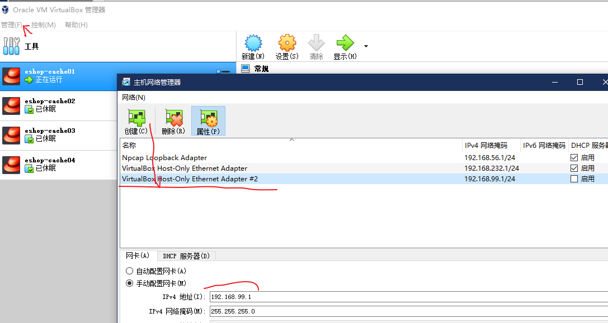
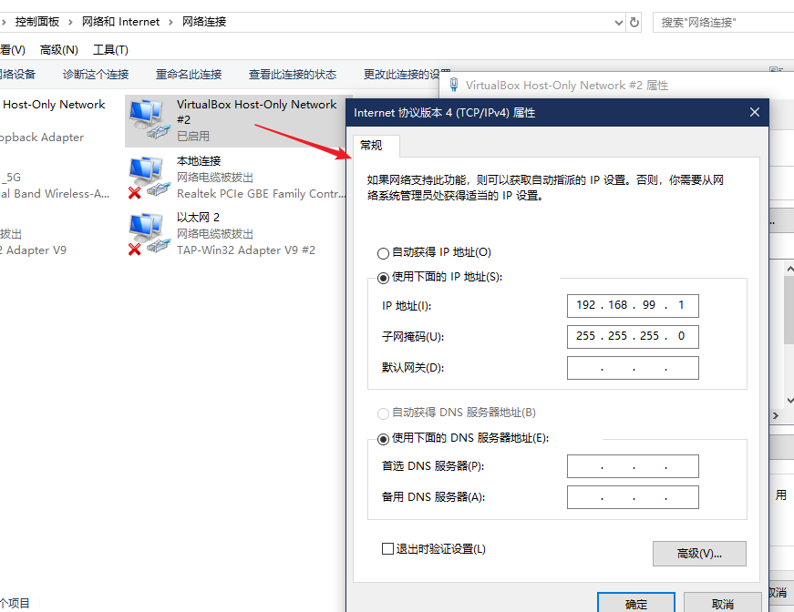
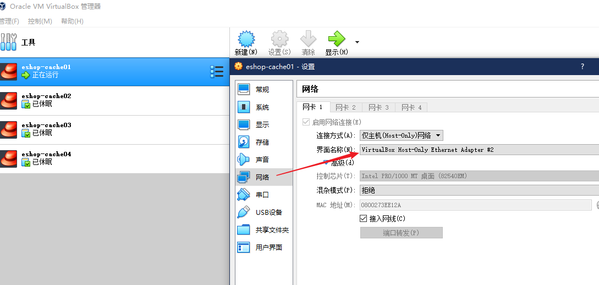
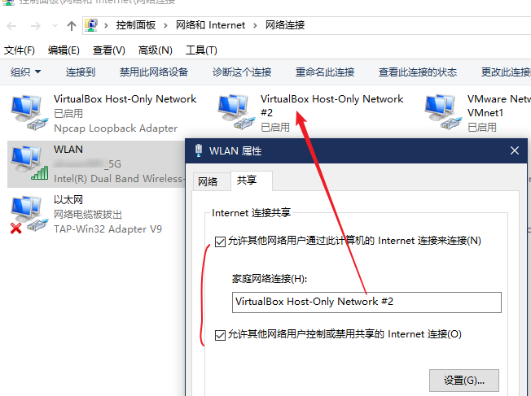
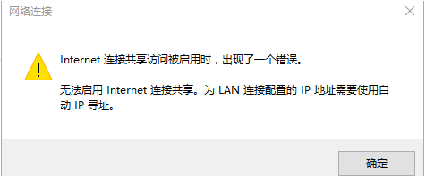
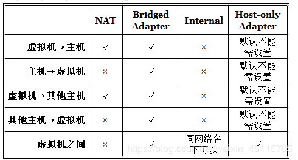

# virtualbox

## win10 Hyper-V 冲突

当 win10 开启了 Hyper-V 那么虚拟机无法运行

```bash
# 关闭
bcdedit /set hypervisorlaunchtype off
# 开启: off -> auto 需要重启计算机
bcdedit /set hypervisorlaunchtype Auto
```

## 启动报错

之前好好的，突然就不能启动了，提示：`创建 VirtualBoxClient COM 对象失败,应用程序将被中断`

解决方案：

1. 运行命令窗口（“Win+R”键，输入 cmd 回车）
2. 进入VirtualBox 的安装目录，默认是 `X:\Program Files\VirtualBox`(视具体情况)
3. 执行命令 `VBoxSVC /ReRegServer`
4. 执行命令：`regsvr32 VBoxC.dll`

## 网络篇- Host Only（win10）

默认是不可上网的。需要配置宿主机上可上网的网卡共享才可以；

好处：与 VMware Network Adapter VMnet8 的功能一致

- 可上网
- 可互通
- 虚拟机与宿主机 ip 段不用在一起

缺点：只能与宿主机进行通信。区域网其他机器不能发现。

配置方式如下：

1. 管理 -> 主机网络管理器

    

    创建一个网络，ipv4 地址填写你虚拟机中要使用的网段

    配置完后，在你本地 控制面板/网络和 Internet/网络连接中会出现一个虚拟网卡

    
2. 配置虚拟机的网卡为刚才新建的网卡

    
3. 在宿主机可上网的网卡上共享网络

    

    在配置的时候，如果之前已经配置过共享，那么需要先关闭并保存后，再次勾选共享并选择虚拟网卡

    在 win10 上，共享时可能会出现如下错误

    

    解决方案是：把虚拟网卡的 ip 地址修改为 192.168.0.1，就能共享成功了，成功之后再把虚拟网卡的 ip 地址修改成你需要的网段即可

在某些情况下，这种配置会失效，比如：选择虚拟机休眠，win10 也选择休眠，再启动的时候，就会失效，
这个时候，只能重复上面的步骤，重新共享下就能解决了

## 最终说明



看上图，说 bridged 都可以，但是貌似又时候又不行。而虚拟机是可以配置多个网卡的。可以一个网卡用 Host Only 方式，去上外网和宿主机 ping 虚拟机，然后使用桥接模式让虚拟机可以 ping 宿主机
