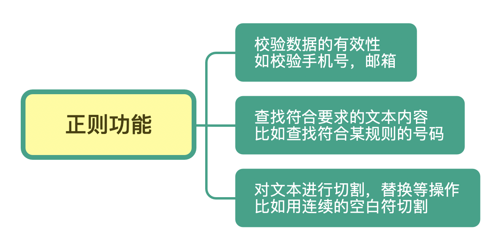
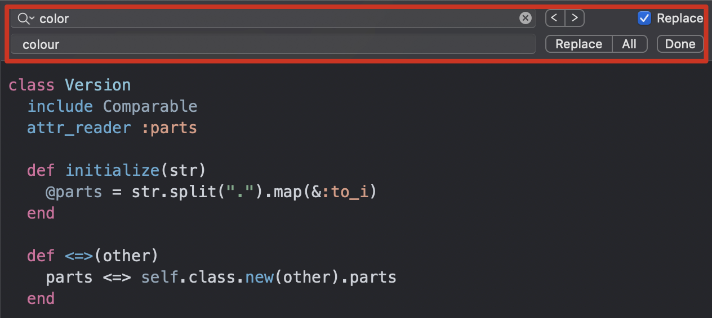
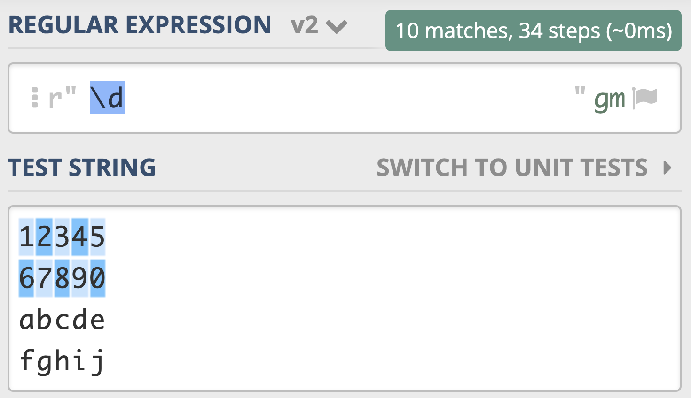
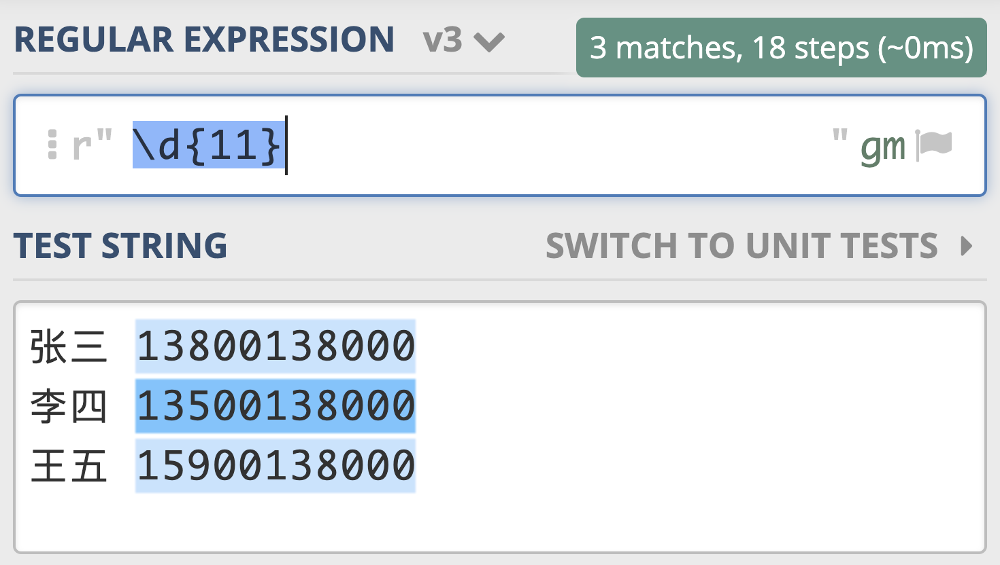
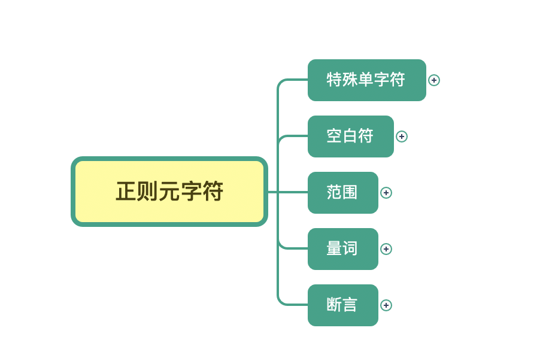
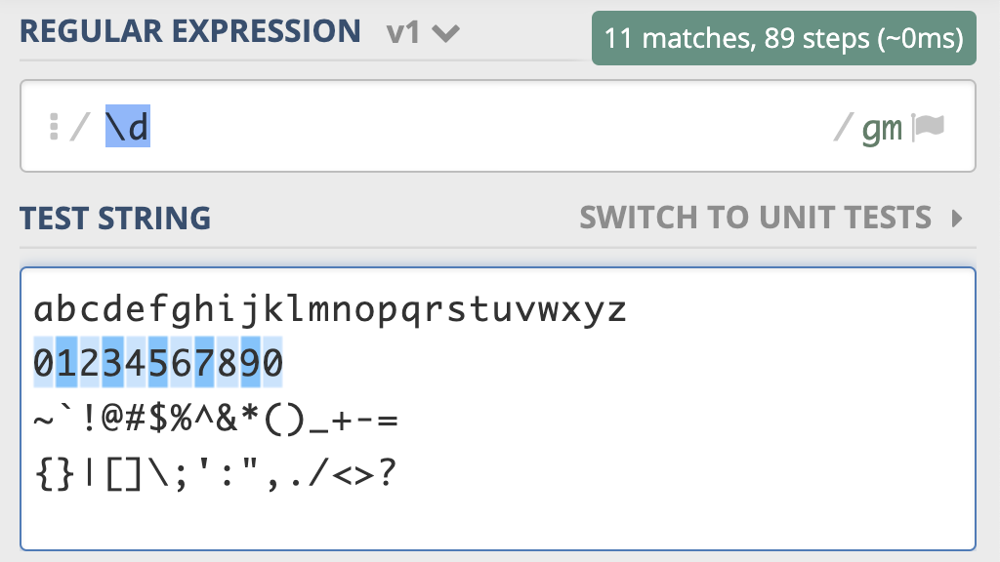
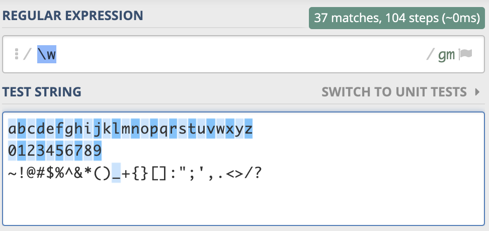

# 01 | 元字符：如何巧妙记忆正则表达式的基本元件?

我们一起来学习组成正则表达式的基本单元——元字符。

## 元字符的概念

在开篇词中，我们提到了正则常见的三种功能，它们分别是：校验数据的有效性、查找符合要求的文本以及对文本进行切割和替换等操作。



那你可能会好奇，正则是如何完成这些工作的呢？让我们先从简单的字符串查找和替换讲起。

我相信你一定在办公软件，比如 Word、Excel 中用过这个功能。你可以使用查找功能快速定位关注的内容，然后使用替换，批量更改这些内容。



让我们再回过头看看正则表达式。正则表达式，简单地说就是描述字符串的规则。在正则中，普通字符表示的还是原来的意思，比如字符 a，它可以匹配 `Hanmeimei is a girl` 中的 H 之后的 a，也可以匹配 is 之后的 a，这个和我们日常见到的普通的字符串查找是一样的。


但除此之外，正则还可以做到普通的查找替换做不到的功能，**它真正的强大之处就在于可以查找符合某个规则的文本**。

举个例子，假如你想查找文本中的所有数字，如果不会正则，可能需要手动敲数字，从 0 到 9 这样操作 10 次，一个个去查找，很麻烦。但如果用正则的话就方便很多了，我们直接使用 `\d` 就可以表示 0-9 这 10 个数字中的任意一个，如下图所示。



如果我们在后面再加上 **量词**，就可以表示单个的数字出现了几次。比如  `\d{11}`  表示单个数字出现 11 次，即 11 位数字，如果文本中只有姓名和手机号，我们就可以利用这个查找出文本中的手机号了，如下图所示。



那么到这里，你有没有发现正则的不同呢？像查找数字一样，在正则中，我们不需要像往常一样输入一个确定的内容，只需要敲入特殊的符号就可以帮我们完成查找和替换，像上面案例中提到的 `\d` 和 `{11}`，在正则中有一个专门的名称—— **元字符（Metacharacter）**。

**所谓元字符就是指那些在正则表达式中具有特殊意义的专用字符**，元字符是构成正则表达式的基本元件。正则就是由一系列的元字符组成的，看到这里相信你也能明白元字符的重要性了吧

但是，因为元字符很基础，又比较多，所以很多人看见正则就头疼。那么今天，我就通过分类的方式，教你理解并且巧妙地记忆、使用元字符。

## 元字符的分类与记忆技巧

正则表达式中有很多的元字符，比如刚刚提到的 `\d`，它在正则中不代表  `\` （反斜杠） 加字母 d，而是代表任意数字，这种表示特殊含义的字符表示，就是元字符。正则表达式中，元字符非常多，那么我们如何才能记住它们呢？

这里我给你介绍一个方法，就是分类记忆。元字符虽然非常多，但如果我们按照分类法去理解记忆，效果会好很多。事实上，这个方法不光可以用在记忆元字符上，也可以用在记忆各种看似没有章法的内容上。

首先，我可以把元字符大致分成这几类：表示单个特殊字符的，表示空白符的，表示某个范围的，表示次数的量词，另外还有表示断言的，我们可以把它理解成边界限定，我会在后面的章节中专门讲解断言（Assertions）相关的内容。



那么接下来，我们就按照前面说的元字符的分类，来逐一讲解下。

## 1. 特殊单字符

首先，我们来看下表示特殊单个字符的元字符，比如：

- 英文的点（`.`）表示换行以外的任意单个字符
- `\d` 表示任意单个数字
- `\w` 表示任意单个数字或字母或下划线
- `\s` 表示任意单个空白符。
- 另外，还有与之对应的三个 `\D`、`\W` 和 `\S`，分别表示着和原来相反的意思。


现在我们来看一下测试，我把常见数字，字母，部分标点符号作为文本，用 \d 去查找，可以看到只能匹配上 10 个数字。



这是元字符 `\d` 测试用例的链接，你不妨测试一下：<https://regex101.com/r/PnzZ4k/1>

元字符 `\w` 能匹配所有的数字、字母和下划线，如下图所示：



同样的，元字符 `\w` 测试用在这里：<https://regex101.com/r/PnzZ4k/2>

你可以自己去尝试一下 `\W`，`\D`，`\s` 和 `\S` ，以及英文的点的匹配情况，这里我不展开了。

上述的测试文本如下：

```
abcdefghijklmnopqrstuvwxyz
01234567890
~`!@#$%^&*()_+-=
{}|[]\;':",./<>?
```

## 2. 空白符

除了特殊单字符外，你在处理文本的时候肯定还会遇到空格、换行等空白符。其实在写代码的时候也会经常用到，换行符 `\n`，TAB 制表符 `\t` 等。

有编程经验的程序员肯定都知道，不同的系统在每行文本结束位置默认的换行会有区别。比如在 Windows 里是 `\r\n`，在 Linux 和 MacOS 中是 `\n`。

在正则中，也是类似于 `\n` 或 `\r` 等方式来表示空白符号，只要记住它们就行了。平时使用正则，大部分场景使用 `\s` 就可以满足需求，`\s` 代表任意单个空白符号。


- `\r`：回车符
- `\n`：换行符
- `\f`：换页符
- `\t`：制表符
- `\v`：垂直制表符
- `\s`：任意空白符

我们可以看到，  `\s`  能匹配上各种空白符号，也可以匹配上空格。换行有专门的表示方式，在正则中，空格就是用普通的字符英文的空格来表示。

## 3. 量词

刚刚我们说到的「基础」的元字符也好，「空白符」也好，它们都只能匹配单个字符，比如 `\d` 只能匹配一个数字。但更多时候，我们需要匹配单个字符，或者某个部分「重复 N 次」「至少出现一次」「最多出现三次」等等这样的字符，这个时候该怎么办呢？

这就需要用到表示量词的元字符了。


- `*`：0 到多次
- `+`：1 到多次
- `？`：0 到 1 次，如 `colou?r`
- `{m}`：出现 m 次
- `{m,}`：出现至少 m 次
- `{m,n}`：m 到 n 次

比如，在文本中「颜色」这个单词，可能是带有 u 的 colour，也可能是不带 u 的 color，我们使用 `colou?r` 就可以表示两种情况了。在真实的业务场景中，比如某个日志需要添加了一个 user 字段，但在旧日志中，这个是没有的，那么这时候可以使用问号来表示出现 0 次或 1 次，这样就可以表示 user 字段 **存在和不存在** 两种情况。

下面这段文本由三行数字组成，当我们使用  `\d+`  时，能匹配上 3 个，但使用  `\d*`  时能匹配上 6 个，详细匹配结果可以参考下面的图片：


匹配到 6 个的时候，会很疑惑，哪里出来的 6 个？往左边看，会发现每个匹配的末尾的空（还是什么）也算一次匹配


我把正则 `\d+` 示例链接放在下面了，你可以看一下：<https://regex101.com/r/PnzZ4k/8>

其它的比如表示 m 到 n 次的，你可以自己去尝试，一定要多加练习，这样你才能记得牢。

上述测试字符：

```
1234567890
1
123
```

## 4. 范围

学习了量词，我们就可以用 `\d{11}` 去匹配所有手机号，但同时也要明白，这个范围比较大，有一些不是手机号的数字也会被匹配上，比如 11 个 0，那么我们就需要在一个特殊的范围里找符合要求的数字。

再比如，我们要找出所有元音字母 `aeiou` 的个数，这又要如何实现呢？在正则表达式中，表示范围的元字符可以轻松帮我们搞定这样的问题。

在正则表达式中，表示范围的符号有四个分类，如下图所示。


- `|` ：或

  比如： `ab|bc` 代表 ab 或 bc

- `[...]`：多选一，括号中任意单个元素

- `[a-z]`：匹配 a 到 z 之间任意单个元素（按 ASCII 表，包含 a，z）

- `[^...]`：取反，不能是括号中的任意单个元素

首先是管道符号，我们用它来隔开多个正则，表示满足其中任意一个就行，比如 `ab|bc` 能匹配上 ab，也能匹配上 bc，在正则有多种情况时，这个非常有用。

中括号 `[]` 代表多选一，可以表示里面的任意单个字符，所以任意元音字母可以用  `[aeiou]` 来表示。另外，中括号中，我们还可以用 **中划线表示范围**，比如  `[a-z]` 可以表示所有小写字母。如果中括号第一个是 **脱字符（^）**，那么就表示非，表达的是 **不能是里面的任何单个元素**。

比如某个资源可能以 `http://` 开头，或者 `https://` 开头，也可能以 `ftp://` 开头，那么资源的协议部分，我们可以使用 `(https?|ftp)://` 来表示。


同样地，我把示例链接也放在了下面，你可以参考一下：<https://regex101.com/r/PnzZ4k/5>

测试文本为：

```
http://www.baidu.com
https://www.baidu.com
ftp://www.baidu.com/a.zip
```

## 总结

今天我通过大量的示例讲解了元字符，希望可以帮助你加强对正则各类元字符的理解，想办法记住它们，这是掌握正则这个强大工具的第一步。

我在这里给你强调一下学习的方法。你可以看到我在每一个案例中加入了测试链接，目的就是希望你能借此多做练习。在学习过程中，一定要找时间去练习，去观察匹配的结果，这样可以帮助你加深记忆。如果只是看和听，没有足够的练习，实际上很难记得牢，所以一定要自己多动手操作尝试。

还有一个方法，你可以把学到的知识，试着讲给其它的同事或同学，最好的学习方法就是去教别人，一个知识点，如果你能给别人讲明白，证明你真的搞懂了，真的掌握了这个知识。

好了，学习完今天的内容，最后我来给你总结一下。正则表达式中元字符的分类记忆，你可以在脑海中回忆一下。今天我们学习了正则表达式的部分元字符，特殊单字符、空白符、范围、量词等。我整理成了一张脑图，你可以看一下，对照着练习、记忆。


## 思考题

通过今天的学习，不知道你元字符掌握到何种程度了呢？那么不妨练习一下吧！我在这里给出一些手机号的组成规则：

1. 第 1 位固定为数字 1；

2. 第 2 位可能是 3，4，5，6，7，8，9；

3. 第 3 位到第 11 位我们认为可能是 0-9 任意数字。

你能不能利用今天学到的知识，写出一个「更严谨」的正则来表示手机号呢？

测试文本

```
张三 13800138000
李四 13500138000
王五 15900138000
三撒 11012345678
```

正则表达式  `1[3-9][0-9]{9}`，前 3 个号码会被匹配，后面一个不会
