# 09丨应用 2：如何在编辑器中使用正则完成工作？

在常见的编辑器中如何使用正则来完成工作

你可能要问了，这是正则专栏，为啥不直接开始讲正则？其实我给你讲的编辑器使用技巧，能够帮助我们更好地完成工作。因为我们学习正则的目的，就是想高效地完成文本处理。

但在实际工作中，我们一般不会只用正则，而是通常将编辑器的特性和正则结合起来，这样可以让文本处理工作更加高效。正所谓「工欲善其事，必先利其器」，你花点时间来了解一下编辑器的各种特性，可以少写很多代码。

## 编辑器功能

接下来，我以 Sublime Text 3 为例，给你讲讲一些在编辑器里的强大功能，这些功能在 Sublime Text、Atom、VS Code、JetBrains 系列（IntelliJ IDEA/PyCharm/Goland 等) 中都是支持的。

### 光标移动和文本选择

在常见的编辑器、IDE、甚至 Chrome 等浏览器中，我们编辑文本时，使用键盘的左右箭头移动光标，可以 **按住 Shift 键** 来选中文本。在左右移动时，如果你按住 **Alt（macOS 的 option）**，你会发现光标可以 **按块移动**，快速移动到下一个单词。两种方式组合起来，你可以快速选择引号里面的内容。

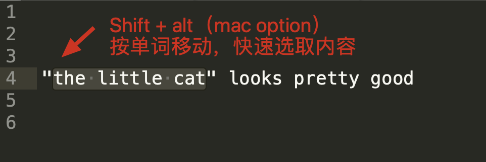

你可以动手练习一下，熟悉一下这些操作。你可能会说，有必要么，我用鼠标拖一下不就可以了？你说得没错，但这个功能和后面我要讲的多焦点编辑、竖向编辑等结合起来，就可以快速多行操作，这是鼠标做不到的。

### 多焦点编辑

在 IDE 中，我们如果想对某个变量或函数重命名，通常可以使用重构（refactor）功能。但如果处理的不是代码，而是普通文本，比如 JSON 字符串的时候，就没法这么用了。不过现在很多编辑器都提供了多焦点编辑的功能。

比如选择单词 route 之后，点击菜单 `Find -> Quick Find All`  就可以选中所有的 route 了。


这个特性结合光标移动，可以快速提取某些内容，比如提取 JSON 中的姓名和手机号。选中所有的字段和值之间的字符（`:`） 之后，按住 `Shift+Alt`（macOS 上是 Shift + Option），用箭头移动光标，可以快速选择到另外一个引号前，然后剪切，再找个空白地方粘贴就可以了。

```json
{
  "error_code": 0,
  "result": {
    "data": [
      {
        "name": "朱小明",
        "tel": "138xx138000"
      },
      {
        "name": "王五",
        "tel": "139xx139000"
      }
    ]
  }
}
```

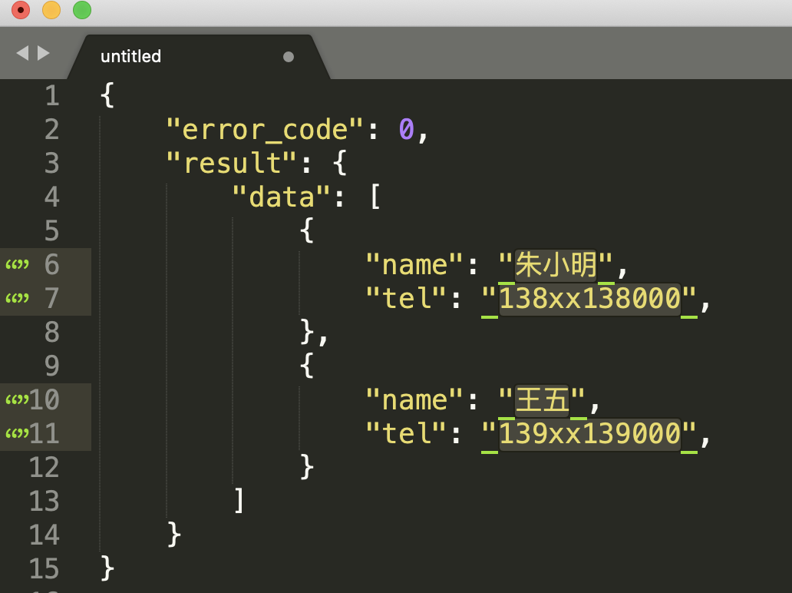

### 竖向编辑

在编辑多行时，如果我们需要编辑的内容都是纵向上同一个位置，就可以使用 `Alt (macOS 上是 Option）加上鼠标拖拽的方式来选择（或者尝试按下鼠标中键拖拽）`。比如下图，当你选择了左侧的两个空格之后，可以批量编辑，比如修改成四个空格。将竖向编辑和刚刚上面说到的光标移动结合起来，会非常方便。

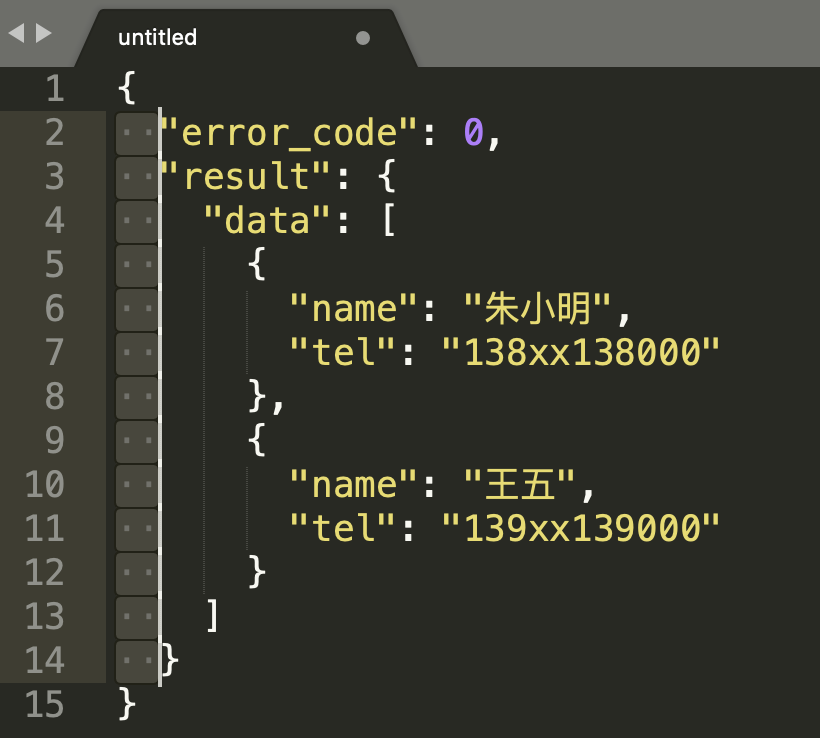

笔者没有尝试成功，但是在 IDE 中尝试成功了。

## 在编辑器中使用正则

**正则是一种文本处理工具**，常见的功能有文本验证、文本提取、文本替换、文本切割等。有一些地方说的正则匹配，其实是包括了校验和提取两个功能。

校验常用于验证整个文本的组成是不是符合规则，比如密码规则校验。提取则是从大段的文本中抽取出需要的内容，比如提取网页上所有的链接。在使用正则进行内容提取时，要做到不能提取到错误的内容（准确性），不能漏掉正确的内容（完备性）。这就要求我们写正则的时候尽量考虑周全。但是考虑周全并不容易，需要我们不断地练习、思考和总结。

### 内容提取

我以编辑器 Sublime Text 3 为例来进行讲解，下图是编辑器 Sublime Text 查找界面的介绍。唤出快捷键是 `Ctrl + F`

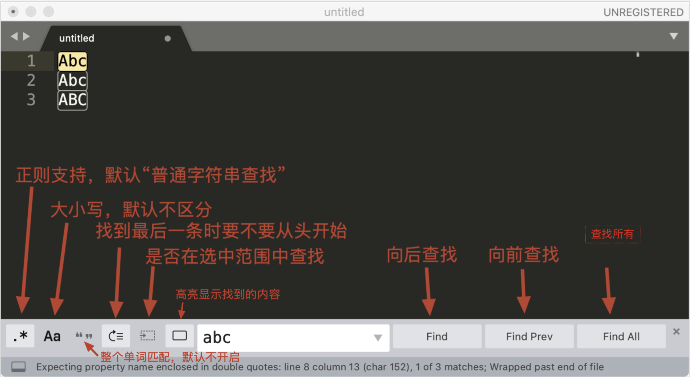

我们来尝试使用 sublime 提取文本中所有的邮箱地址，这里并不要求你写出一个完美的正则，因此演示时，使用`\S+@\S+\.\S+`  这个正则。另外我们可以加上环视，去掉尾部的分号。你可以在 [这里随机生成一些邮箱用于测试](http://www.zhongguosou.com/mailharddisk/mail_address_creator.aspx)。

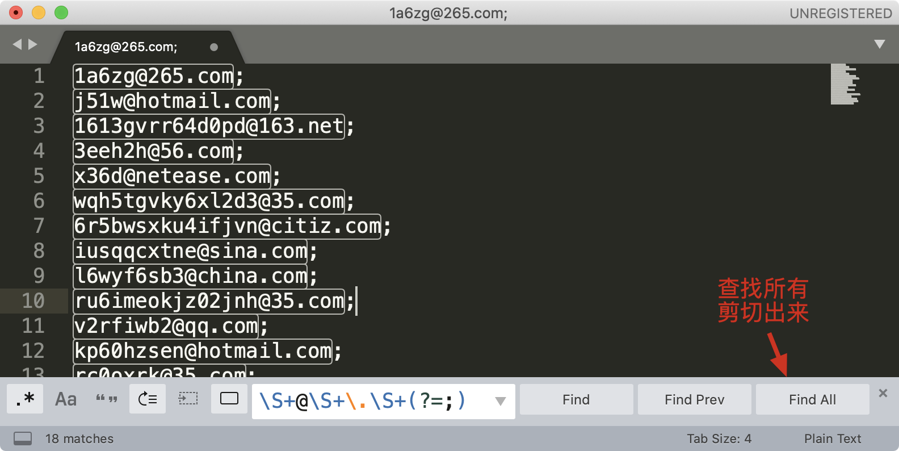

这里简单复习下环视：`\S+@\S+\.\S+(?=;)`，`(?=;)` 表示右边是分号 `;` ，满足这个文本内容，但是 **分号是环视匹配的，所以不是最后的匹配文本结果**，就只会匹配到邮箱 而不包含分号了。

你可能会有疑问，我直接找到最后的分号，然后删除掉不就可以了么？这个例子是没问题的，但如果文本中除了邮箱之外，还有其它的内容这样就不行了，这也是正则比普通文本强大的地方。

比如说下面这种文本，想要直接复制邮箱出来

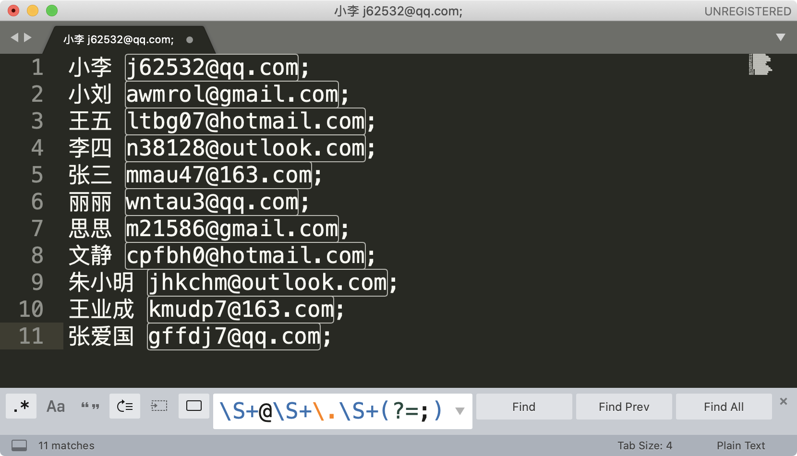

### 内容替换

说完了查找，我们再来看一下替换。之前课程里我们也有讲过，这里再来回顾一下。下图是编辑器 Sublime Text 替换界面的介绍。唤出快捷键是 `Shift + Ctrl + F`

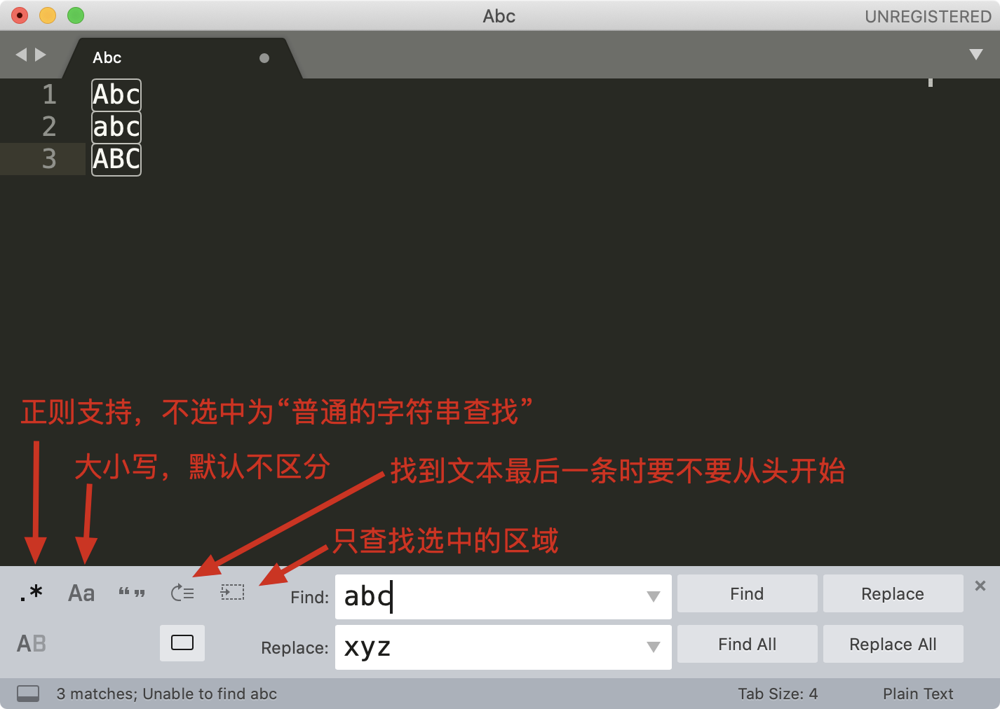

同样是上面邮箱的例子，我们可以使用子组和引用，直接替换得到移除了分号之后的邮箱，我们还可以在邮箱前把邮箱类型加上。操作前和操作后的示意图如下：

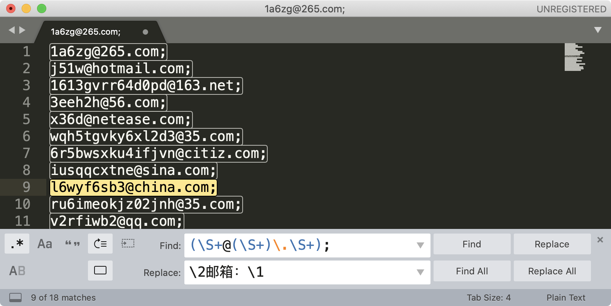

上图中的查找正则：`(\S+@(\S+)\.\S+);` 简化下是 `(xx@(qq).com);`  查找的文本是包含分号的，是因为使用替换的时候完全由我们这里写的内容替换掉。如果还用之前的环视，替换时，分号会被保留下来。替换后的结果如下图

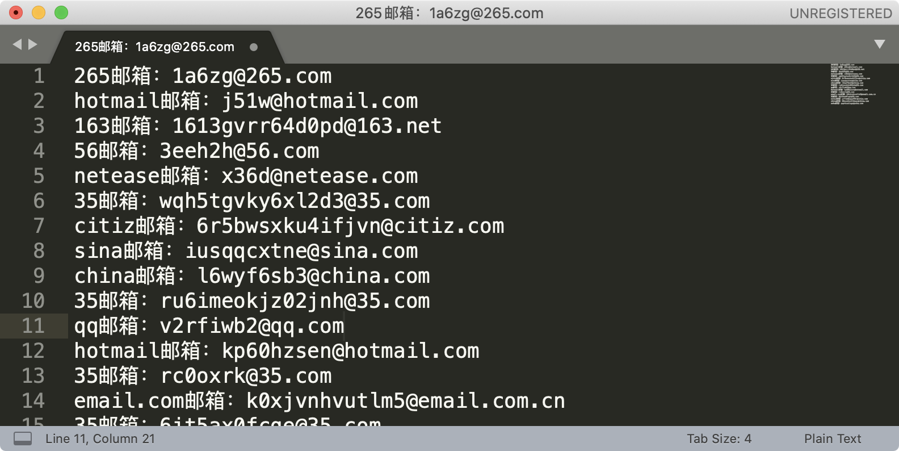

替换和提取的不同在于，**替换可以对内容进行拼接和改造**，**而提取是从原来的内容中抽取出一个子集，不会改变原来的内容**。当然在实际应用中，可以两个结合起来一起使用。

### 内容验证

在编辑器中进行内容验证，本质上和内容提取一样，只不过要求编辑器中全部内容都匹配上，并且匹配次数是一次。


上图中的 `(?s).+`  前面已经很熟悉了，`(?s)` 开启单行模式， `.+`   一个任意字符或则多个任意字符

### 内容切割

在编辑器中进行内容切割，本质上也和内容提取一样，**用什么切割，我们就提取什么**，选中全部之后，把选中的内容删除掉或者编辑成其它的字符。


大写的 W `\W+`，任意非字母下划线，就选中了途中高亮的这些

## 其他编辑器对正则的支持

刚刚我们讲解了在 Sublime Text 中使用正则处理文本的方法，其它的编辑器或 IDE，如 Atom、VS Code、JetBrains 系列（IntelliJ IDEA/PyCharm/Goland 等）等，也都是类似的，你可以在自己喜欢的编辑器中练习一下今天讲到的内容。

这里给出一些主流跨平台编辑器 /IDE 对正则的支持情况，你可以参考一下。

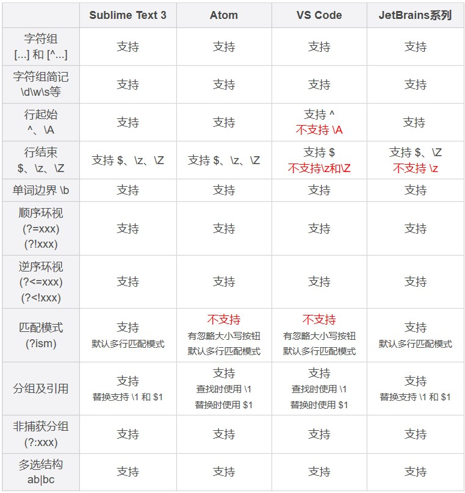

## 总结

今天我们学习了编辑器中一些提高文本处理效率的操作方式：光标移动和选择、多焦点编辑以及竖向编辑。学会了这些，即使不使用正则，我们在编辑器中处理文本效率也会大大提高。接着通过一些示例，我们学习了在编辑器中使用正则来进行文本内容提取，内容替换等操作。正则的使用一般会和其它的方法结合起来，最终帮助我们高效地完成文本的处理工作。

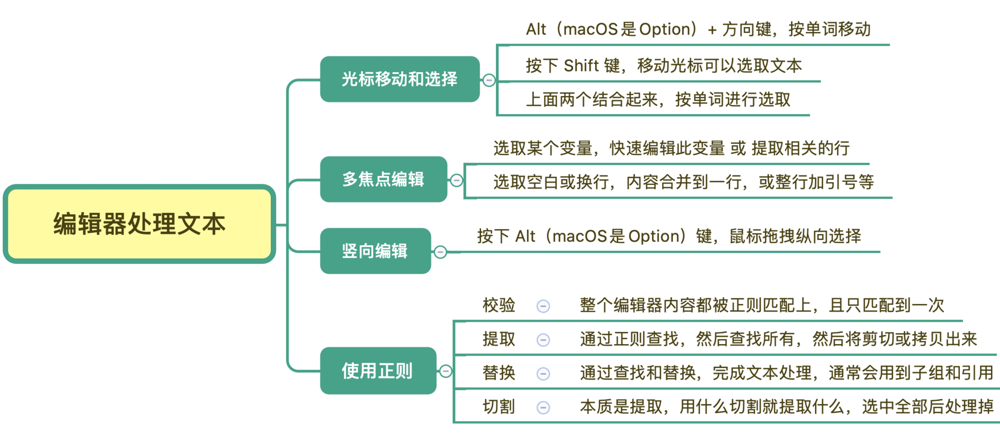

## 课后思考

最后，我们来做一个小练习吧：统计一篇英文文章中每个单词出现的次数，使用 Sublime Text 等编辑器提取文章里所有的单词，处理成一行一个单词，保存到文件中，然后再使用 sort、uniq 等命令统计单词出现的次数。

为了帮你更好地完成这个任务，你可以参考一下下面的提示：

- windows 上的同学可以使用 git for windows 工具。

- 使用 uniq 前需要先用 sort 命令排序，`uniq -c` 可以统计次数。

```bash
sort words.txt | uniq -c

# 如果想取前10名，可以继续对结果排序
sort words.txt | uniq -c | sort -nrk1 | head -n10

# 至于为什么要加 n、r 和 k1 你可以通过 man sort 看一下说明
```

测试文本如下

```
There are moments in life when you miss someone so much that you just want to pick them from your dreams and hug them for real! Dream what you want to dream;go where you want to go;be what you want to be,because you have only one life and one chance to do all the things you want to do.
```


如上图，只服药找到所有的单词后，`Find All` 再复制，再打开一个文件直接粘贴，就变成一行一个单词了。

```bash
$ sort 1.txt | uniq -c
      1 all
      2 and
      1 are
      2 be
      1 because
      1 chance
      1 do
      1 do
      1 dream
      1 Dream
      1 dreams
      1 for
      1 from
      2 go
      1 have
      1 hug
      1 in
      1 just
      2 life
      1 miss
      1 moments
      1 much
      2 one
      1 only
      1 pick
      1 real
      1 so
      1 someone
      1 that
      1 the
      2 them
      1 There
      1 things
      6 to
      5 want
      2 what
      1 when
      1 where
      7 you
      1 your
```

还有一种不使用编辑器的方式：

```bash
# grep -o 只输出匹配的部分，输出的则是一行一个匹配单词
$ grep -Po '\w+' 1.txt | sort | uniq -c | sort -nr
      7 you
      6 to
      5 want
      2 what
      2 them
      2 one
      2 life
      2 go
      2 do
      2 be
      2 and
      1 your
      1 where
      1 when
      1 things
      1 There
      1 the
      1 that
      1 someone
      1 so
      1 real
      1 pick
      1 only
      1 much
      1 moments
      1 miss
      1 just
      1 in
      1 hug
      1 have
      1 from
      1 for
      1 dreams
      1 Dream
      1 dream
      1 chance
      1 because
      1 are
      1 all

```
